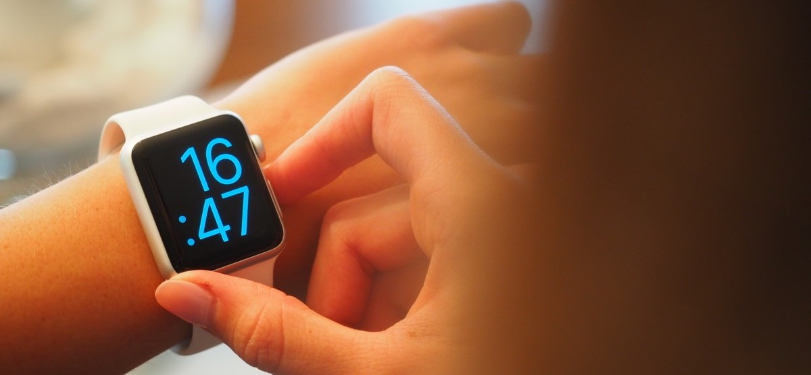
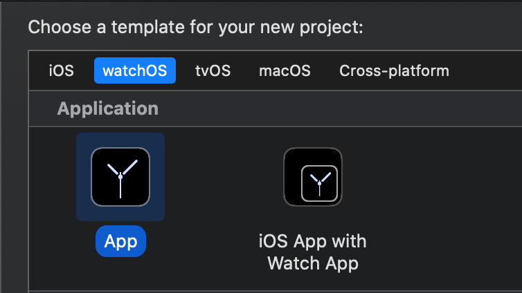
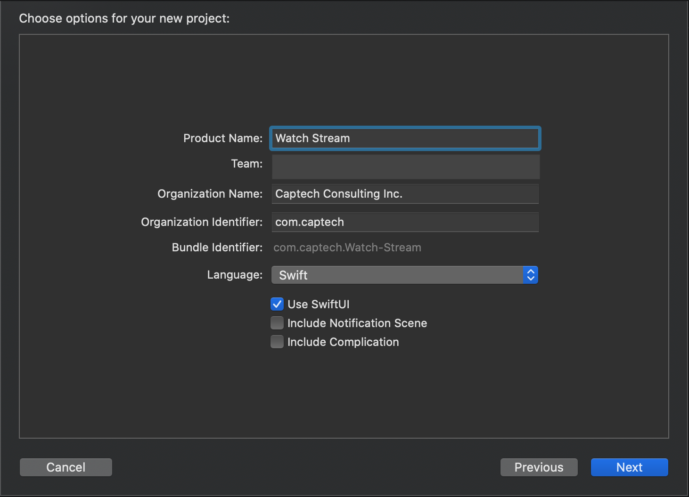
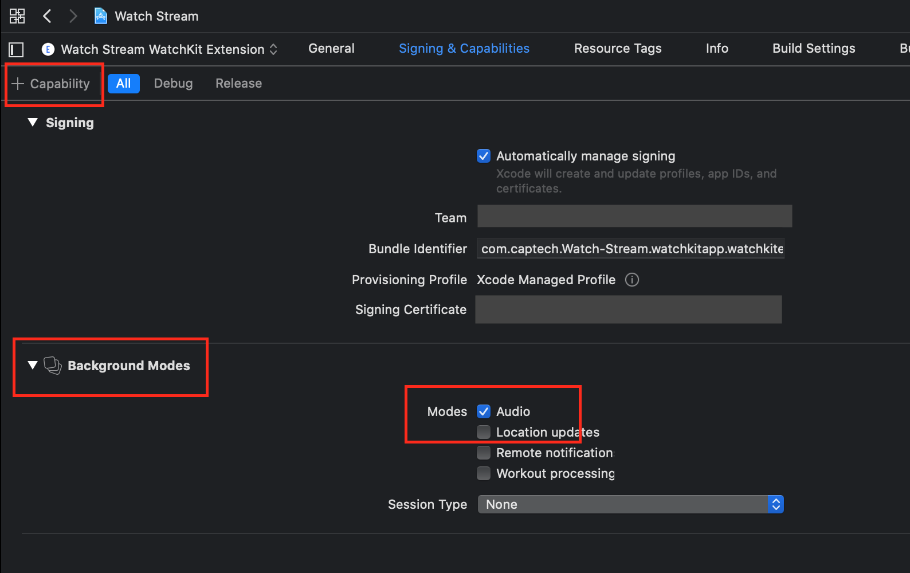
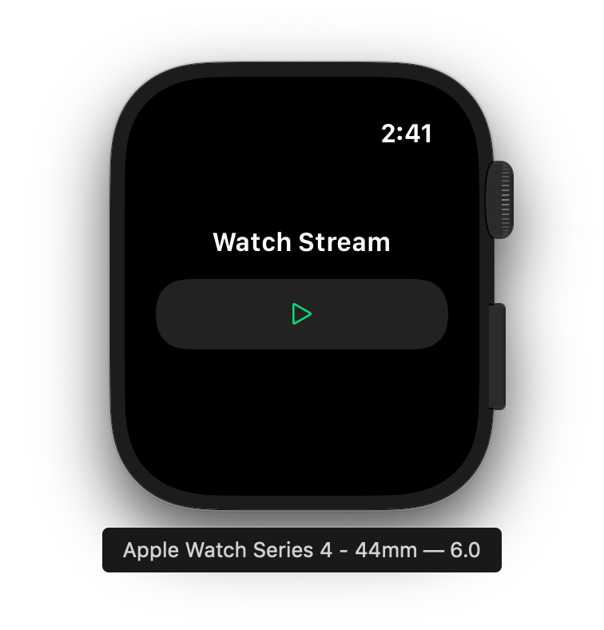

<!--image use creative commons license: https://creativecommons.org/publicdomain/zero/1.0/-->

## Independent apps in watchOS 6

Apple announced watchOS 6 this year at the WWDC2019 developers conference. While most of the new features were somewhat expected (new faces, updated apps), there are two new features that I think are particularly interesting for developers - App Store for Apple Watch, and app independence.  

><b>in·de·pend·ent</b>  
<i>adjective</i>
1.
free from outside control; not depending on another's authority.  
<i>synonyms</i>:	freethinking, individualistic, unconventional, maverick

In this blog post we are going to look at these new developments and create a working independent watchOS app.

###App Store for Apple Watch

Apple announced the creation of a new App Store to provide apps exclusively to Apple Watch. The store will allow Apple Watch users to discover, download, and install apps directly to their watch. That means you no longer have to use (or even install) a companion iPhone app. This change will presumably create more opportunity for developers to have their watchOS apps exposed directly to potential customers, and provides a better on-watch app experience. 

Further, the availability of watch apps as independent downloads means that developers no longer have to create an iPhone app for every watchOS app - a welcome change that untethers watch and phone when it makes sense to do so.

###Independent Apps

As mentioned above, watchOS 6 provides opportunities for developers to focus on Apple Watch as an independent platform within the Apple device ecosystem. This change means apps can run as stand-alone products that can offer a full-featured experience to end users, especially when combined with cellular data (available on Apple Watch series 3 and 4).  

></a>"Independent apps don’t need an iOS companion app to operate properly. Users can choose to install the iOS app, the watchOS app, or both." - <a herf="<a herf="https://developer.apple.com/documentation/watchkit/creating_independent_watchos_apps">Apple Developer website</a>

Networking, audio streaming (no longer limited to only Apple Music), software updates directly from the App Store and more will round out watchOS 6 when released later this year. 

###Create a demo app

To demonstrate how independent apps work, we are going to create a simple watchOS 6 app. We will be using the new <a href="https://developer.apple.com/xcode/swiftui/" target="_new">SwiftUI</a> framework and the new <a href="https://developer.apple.com/design/human-interface-guidelines/sf-symbols/overview/" target="_new">SF Symbols</a> scalable icons, along with the new audio streaming capabilities of watchOS 6.

To do this demo you will need to download and install the developer betas for macOS 10.15 (Catalina), and Xcode 11 (note that an Apple Developer account is required to download beta software from Apple).

<https://developer.apple.com/download/>

><b>Note</b>: At the time of writing, the watchOS simulator is unable to play streaming audio. As such, you will need to use an iPhone and paired Apple Watch running the lastest beta OS to actually hear the streamed audio in this demo.
>

####Getting Started

In Xcode, create a new watchOS project and select the App icon, then click Next

   
Next, complete the project options and make sure you check the “Use SwiftUI” option, then click continue.

Finally, In the Xcode IDE select the Watch Kit Extenion target and add the Background Modes capability, then check the "Audio" mode.

Now that we've set up our project, lets start coding!

In the Xcode IDE, select the `ContentView.swift` file. Xcode uses the ContentView view struct to instantiate the HostingController in the main storyboard. We will edit the ContentView file to create our UI using the SwiftUI framework.

First we will need to add our audio player variables. These should be placed at the top of the ContentView file:

	import SwiftUI
	import AVFoundation
	
	private let session = AVAudioSession.sharedInstance()
	private let podcastURLstring = "https://media.blubrry.com/dataguruspodcast/b/content.blubrry.com/dataguruspodcast/DGP_Ben_Harden_036.mp3"
	private var player: AVPlayer?
	private var playerItem: AVPlayerItem?

Next, add this line to the ContentView struct:

    @State var playing = false

This boolean is a <a href="https://developer.apple.com/documentation/swiftui/binding" target="_new">bound property</a> that will be used to update our UI when the audio player state changes. 

Next, replace the `body` variable with this:

	var body: some View {
        VStack {

            // create a text label
            Text("Watch Stream").font(.headline)
            
			// create our play button
            Button(action: { 
                playPauseActionHandler { (success) in
                    self.playing = success // bound property, UI will rebuild when it changes
                }
            }) {
                
                playing ? Image(systemName: "pause") : Image(systemName: "play") // using SF Symbols
                
            }.foregroundColor(playing ? Color.orange : Color.green)
        }
    }

Here we’ve created a title label and a button to play and pause our streaming audio. When you run the app in the Xcode simulator, you will see a screen like this:

Next we will add the button action handler function and related audio functions for streaming audio to the watch.

	private func playPauseActionHandler(completion: ((Bool)->Void)? = nil) {
	    
	    if player == nil {
	        configureAudioSession() // call just before playing first audio
	    }
	    
	    if let url = URL(string: podcastURLstring) {
	        
	        playerItem = AVPlayerItem(url: url)
	        player = AVPlayer(playerItem: playerItem)
	        
	        session.activate(options: []) { (success, error) in
	            
	            guard error == nil else {
	                print("*** An error occurred: \(error!.localizedDescription) ***")
	                completion?(false)
	                return
	            }
	            
	            if success { // false if no audio route (e.g. no headphones, user cancel, etc.)
	                if audioStreamIsPlaying {
	                    player?.pause()
	                } else {
	                    player?.play()
	                }
	            }
	            
	            completion?(success)
	        }
	    }
	}

In this function we are setting up and using an audio streaming _session_. An audio session is created using the shared AVAudioSession object. <a href="https://developer.apple.com/documentation/avfoundation/avaudiosession" target="_new">You can learn more about AVAudioSession here.</a>. 

To complete our app, we need to add the remaining support functions. 

Add these functions to the ContentView.swift file:

	private var audioStreamIsPlaying: Bool {
	    
	    if let audioPlayer = player {
	        return audioPlayer.rate > 0 // audio is playing
	    }
	    
	    return false
	}
	
	private func configureAudioSession() {
	    
	    do {
	        try session.setCategory(AVAudioSession.Category.playback,
	                                mode: .default,
	                                policy: .longFormAudio,
	                                options: [])
	    } catch let error {
	        fatalError("*** Unable to set up the audio session: \(error.localizedDescription) ***")
	    }
	}

Now that we've completed our code you can run the app. As mentioned above, this will have to be run on an watch that's paired with an iPhone both running the latest beta OS. (even though it's an independent app, Xcode uses the phone to push the app through to the watch)

###Go Deeper

Here are some helpful links to take a deeper dive into independent watchOS apps:

* <a href="https://developer.apple.com/documentation/watchkit/creating_independent_watchos_apps" target="_new">Creating Independent watchOS Apps</a>
* <a href="https://developer.apple.com/documentation/watchkit/building_watchos_app_interfaces_with_swiftui" target="_new">Building watchOS App Interfaces with SwiftUI</a>
* <A href="https://developer.apple.com/videos/play/wwdc2019/716/" target="_new">Streaming Audio on watchOS 6</a>

--
#####John Morrison

(bio here)

